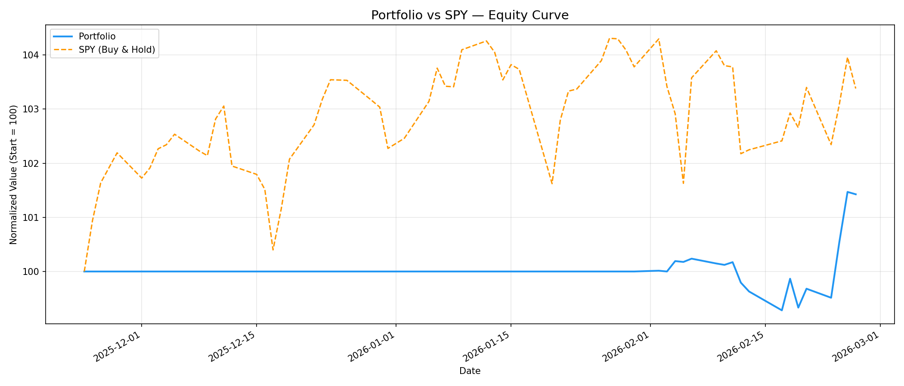
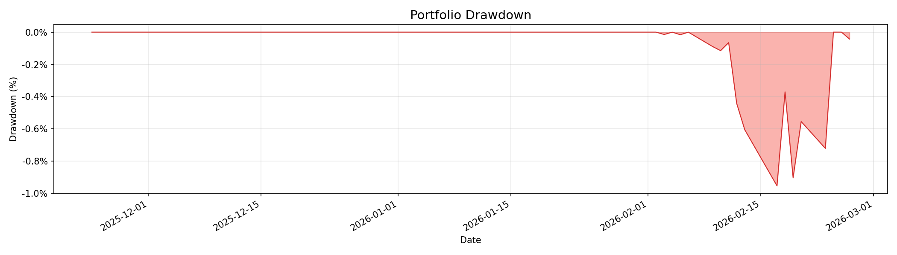
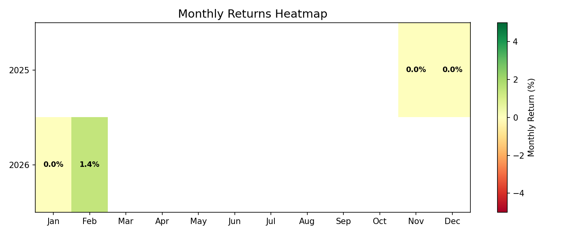

# Portfolio Backtest Simulation Report
**Date**: 2026-02-27
**Generated**: 2026-02-27 21:40:44

---

## Performance Summary

| Metric | Portfolio | SPY (Buy & Hold) |
|--------|-----------|-------------------|
| Initial Capital | $100,000 | $100,000 |
| Final Equity | $101,426 | $103,380 |
| Total Return | 1.43% | 3.38% |
| Annualized Return | 5.65% | — |
| **Excess Return** | **-1.95%** | — |

## Risk Metrics

| Metric | Value |
|--------|-------|
| Sharpe Ratio | 0.35 |
| Max Drawdown | -0.95% |
| Max DD Duration | 10 trading days |
| Calmar Ratio | 5.94 |

## Trade Statistics

| Metric | Value |
|--------|-------|
| Total Trades | 15 |
| Win Rate | 86.7% |
| Avg Win | 2.23% |
| Avg Loss | 4.13% |
| Win/Loss Ratio | 0.54 |
| Avg Holding Period | 6 trading days |
| Total P&L (Dollar) | $1,426 |

## Simulation Parameters

| Parameter | Value |
|-----------|-------|
| Strategy | conviction |
| Initial Capital | $100,000 |
| Simulation Period | 94 calendar days |
| SQS Threshold | >= 44 (Gold/Silver grade) |
| Stop-Loss | -5% |
| Take-Profit | 15% |
| Max Holding Days | 60 |
| Max Position Size | 10% |

## Trade Details (Top 20 by P&L)

| # | Ticker | Direction | Entry | Exit | Entry$ | Exit$ | P&L | P&L% | Days | Exit Reason | Politician |
|---|--------|-----------|-------|------|--------|-------|-----|------|------|-------------|------------|
| 1 | **PYPL** | Long | 2026-02-18 | 2026-02-26 | $41.45 | $45.53 | $698 | 9.84% | 6 | 模擬結束平倉 | John Boozman |
| 2 | **NFLX** | Long | 2026-02-18 | 2026-02-26 | $77.99 | $84.59 | $530 | 8.46% | 6 | 模擬結束平倉 | Richard W. Allen |
| 3 | **GS** | Long | 2026-02-24 | 2026-02-26 | $902.27 | $929.00 | $226 | 2.96% | 2 | 模擬結束平倉 | David H McCormick |
| 4 | **TPYP** | Long | 2026-02-18 | 2026-02-26 | $40.39 | $41.12 | $127 | 1.80% | 6 | 模擬結束平倉 | John Boozman |
| 5 | **RNWGX** | Long | 2026-02-18 | 2026-02-26 | $100.55 | $102.24 | $120 | 1.68% | 6 | 模擬結束平倉 | John Boozman |
| 6 | **AAPL** | Long | 2026-02-03 | 2026-02-26 | $269.23 | $272.95 | $102 | 1.38% | 16 | 模擬結束平倉 | Nancy Pelosi |
| 7 | **VNQI** | Long | 2026-02-18 | 2026-02-26 | $50.23 | $50.76 | $74 | 1.06% | 6 | 模擬結束平倉 | John Boozman |
| 8 | **MBB** | Long | 2026-02-18 | 2026-02-26 | $96.26 | $96.75 | $36 | 0.51% | 6 | 模擬結束平倉 | John Boozman |
| 9 | **JMBS** | Long | 2026-02-18 | 2026-02-26 | $46.16 | $46.38 | $34 | 0.48% | 6 | 模擬結束平倉 | John Boozman |
| 10 | **IVV** | Long | 2026-02-18 | 2026-02-26 | $689.35 | $692.41 | $32 | 0.44% | 6 | 模擬結束平倉 | John Boozman |
| 11 | **GIGB** | Long | 2026-02-18 | 2026-02-26 | $46.76 | $46.84 | $11 | 0.16% | 6 | 模擬結束平倉 | John Boozman |
| 12 | **CMBS** | Long | 2026-02-18 | 2026-02-26 | $49.50 | $49.55 | $7 | 0.10% | 6 | 模擬結束平倉 | John Boozman |
| 13 | **TBLL** | Long | 2026-02-18 | 2026-02-26 | $105.47 | $105.55 | $6 | 0.08% | 6 | 模擬結束平倉 | John Boozman |
| 14 | **V** | Long | 2026-02-18 | 2026-02-26 | $320.30 | $316.70 | $-74 | -1.12% | 6 | 模擬結束平倉 | John Boozman |
| 15 | **LITP** | Long | 2026-02-18 | 2026-02-20 | $13.73 | $12.75 | $-505 | -7.14% | 2 | 停損 (-7.14%) | John Boozman |

## Exit Reason Distribution

| Exit Reason | Count | Total P&L |
|-------------|-------|-----------|
| 停損 | 1 | $-505 |
| 模擬結束平倉 | 14 | $1,931 |

## Charts

## Methodology

### Signal Generation

- Source: congress_trades table (congressional trading disclosures)
- Filter: SQS (Signal Quality Score) >= 44.0 (Gold/Silver grade)
- Signal scoring: 40% SQS + 20% filing lag + 20% amount + 10% politician rank + 10% convergence
- Buy signals: enter long at next-day close
- Sale signals: used as contrarian indicator (enter long)

### Risk Management

- Stop-loss: -5% from entry
- Take-profit: 15% from entry
- Max holding period: 60 trading days
- Max position size: 10% of portfolio

### Position Sizing

- Conviction-weighted: 3% base + up to 7% based on signal score

## Disclaimer

This is a historical simulation for research purposes only. It does not 
constitute investment advice. Past performance does not guarantee future 
results. Transaction costs, slippage, and market impact are not included. 
Congressional trading disclosures are subject to reporting delays.

---
*Generated by Political Alpha Monitor — Portfolio Simulator v1.0 — 2026-02-27 21:40:44*
